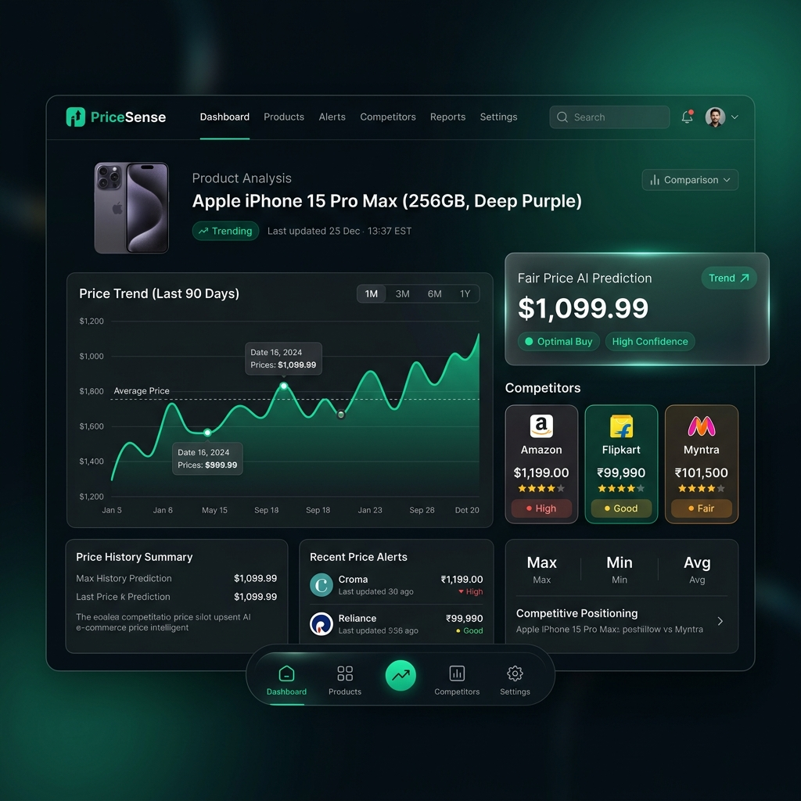
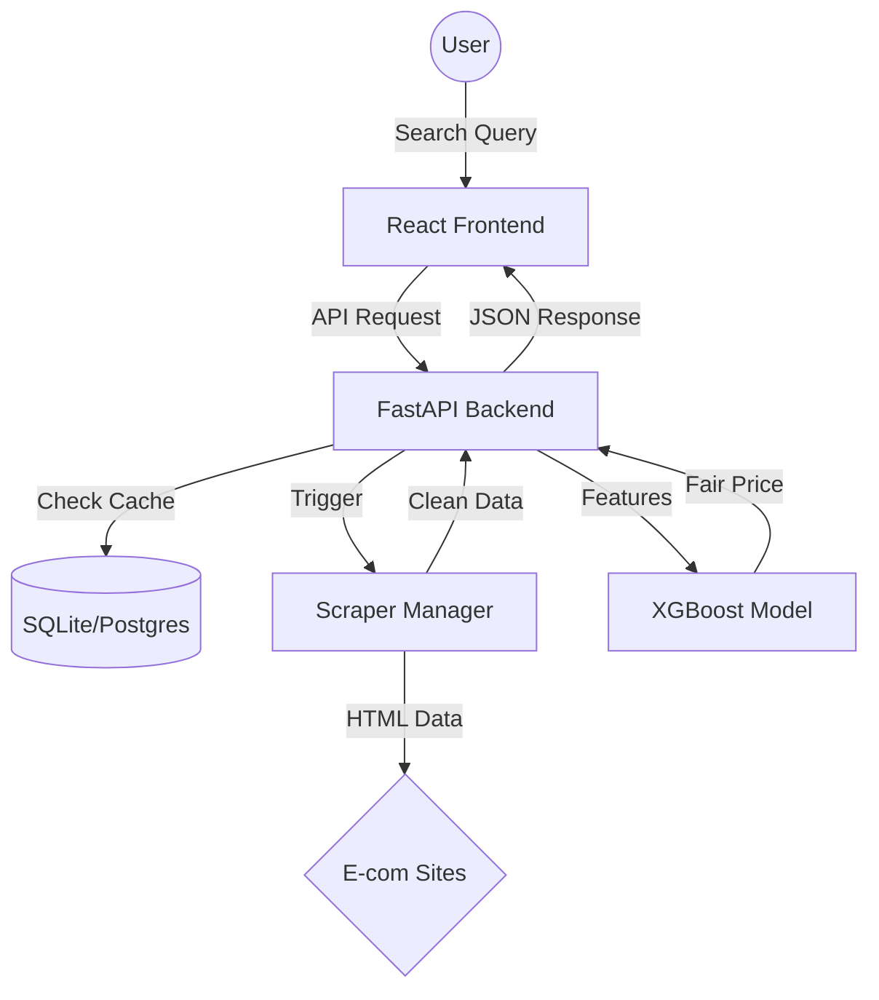

# 🚀 PriceSense — AI-Powered E-Commerce Price Intelligence



**PriceSense** is an industry-grade, full-stack platform designed to revolutionize how consumers shop online. By leveraging **Machine Learning (XGBoost)** and **Real-time Web Scraping**, PriceSense compares product prices across major platforms like Amazon, Flipkart, Meesho, and Myntra, detects "Fake Discounts," and predicts the fair market value of any product.

---

## ✨ Key Features

- **🔍 Multi-Platform Search**: Search once and get live prices from Amazon, Flipkart, Myntra, and Meesho simultaneously.
- **🤖 AI Fair Price Prediction**: Our trained **XGBoost model** analyzes brand value, ratings, reviews, and historical trends to predict what you *should* be paying.
- **🛡️ Fake Discount Detection**: Automatically flags listings where the MRP has been artificially inflated to show a "huge" discount.
- **📈 Price Trend Analysis**: Interactive 12-month price history charts to help you time your purchase.
- **🔔 Smart Price Alerts**: Set your target price and get notified when the product hits your budget.
- **📊 Analytics Dashboard**: Comprehensive view of your search history, saved products, and market savings overview.

---

## 🛠️ Technology Stack

| Layer | Technologies |
| :--- | :--- |
| **Frontend** | React.js, Tailwind CSS, Recharts, Lucide Icons, Axios |
| **Backend** | FastAPI (Python), SQLAlchemy, Pydantic, OAuth2 + JWT |
| **Machine Learning** | Scikit-learn, XGBoost, Pandas, Joblib |
| **Database** | PostgreSQL / SQLite (Development) |
| **Scraping** | BeautifulSoup4, Requests (Rotating User-Agents) |

---

## 🏗️ System Architecture



---

## 🖥️ Dashboard Interface

The PriceSense Dashboard provides a premium experience for price tracking:

1.  **Search & Compare**: A sleek interface to visualize price differences instantly.
2.  **ML Insights**: A dedicated panel explaining why a price is "Fair," "Overpriced," or "Underpriced."
3.  **Savings Tracker**: Highlights the exact amount you save by choosing the best platform.
4.  **Trend Visualization**: Professional-grade charts showing price volatility over time.

---

## 🚀 Setup & Installation

### 1. Prerequisites
- Python 3.10+
- Node.js 18+
- Git

### 2. Backend Setup
```bash
cd backend
python -m venv venv
source venv/bin/activate  # Windows: venv\Scripts\activate
pip install -r requirements.txt
python -m alembic upgrade head
python -m app.ml.train    # Train the AI models
python -m uvicorn app.main:app --reload
```

### 3. Frontend Setup
```bash
cd frontend
npm install
npm run dev
```

---

## 👨‍💻 Author
**Shivam Pajiyar**  
*AI & Full Stack Developer*  
[GitHub Profile](https://github.com/shivampajiyar29)

---

## 📜 License
This project is licensed under the MIT License - see the [LICENSE](LICENSE) file for details.
